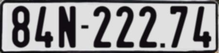
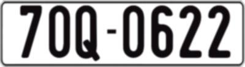
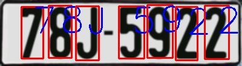
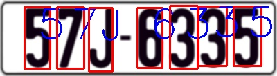
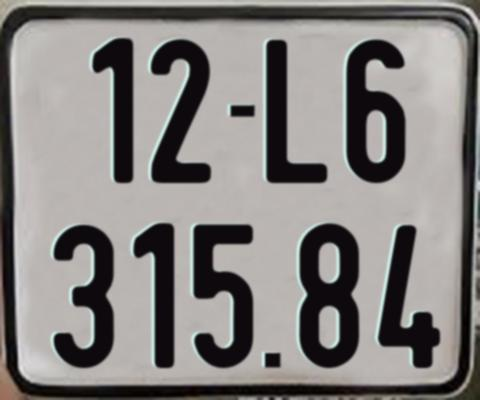
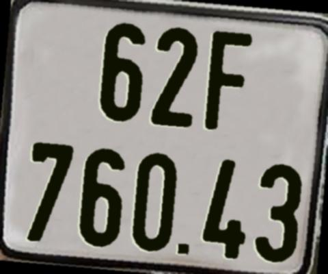
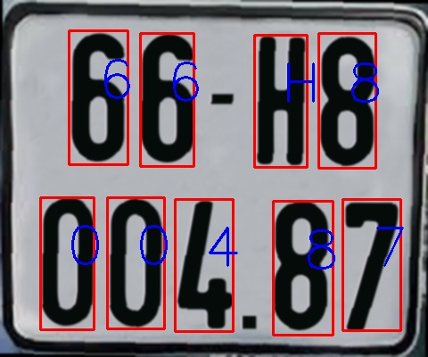
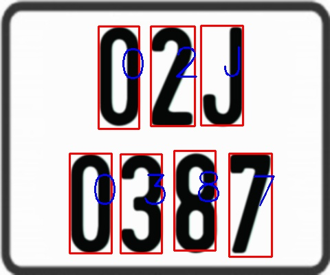

# Vietnamese-License-Plate-Generator
Vietnamese License Plate Generator for OCR part

# Example

Rectangle type

<p align="center">
  
  
  
  
</p>

Square type

<p align="center">
  
  
  
  
</p>

# Simple use
```
pip install -r requirements.txt
python synthesis_plate.py --numb 1000 --output_dir output
```
# Modify config
* Available characters, numbers, template in top of **synthesis_plate.py** file 
* Current generate only labels in YOLO format
